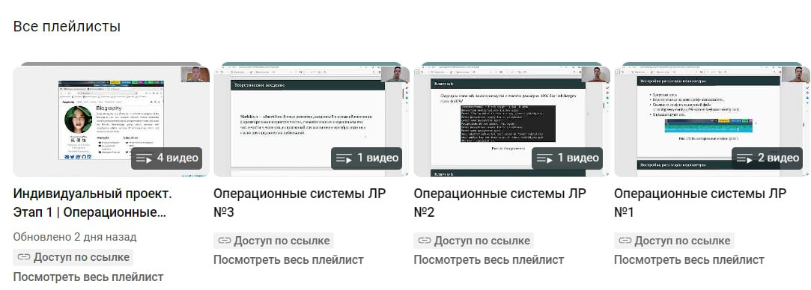

Доброго времени суток ! В этом посте я расскажу вам о своей прошедшей неделе.

## Понедельник

В понедельник я посетил 2 лекции, а после них я начал делать домашнее задание по английскому. Вечером я отдыхал)

## Вторник 

Утром у меня не было пар, поэтому я записывал видео выполнения лабораторных работ по Операционным системам.

Днем я сходил на физкультуру, где мы катались на лыжах. Хоть я и не очень люблю лыжи, но было весело)

## Среда и четверг

В эти дни у меня больше всего пар в университете, поэтому я был сильно занят оба дня, но старался дома выполнять свои ДЗ.

## Пятница

В пятницу у нас были пары по английскому и немецкому языках. Ну а после них я доделывал лабораторные работы..

## Выходные 

На выходных я отдыхал, высыпался, и гулял со своими друзьями.

Вот так и прошла моя неделя, если кому-то вообще было интересно и вы дочитали это. Спасибо за внимание!

